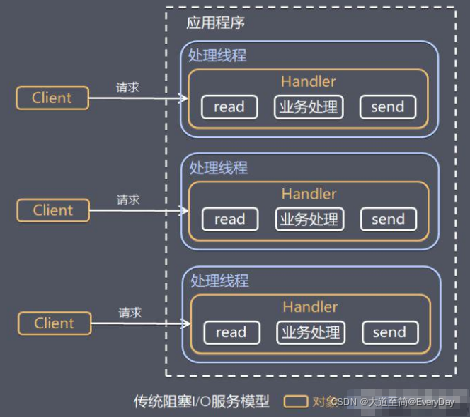
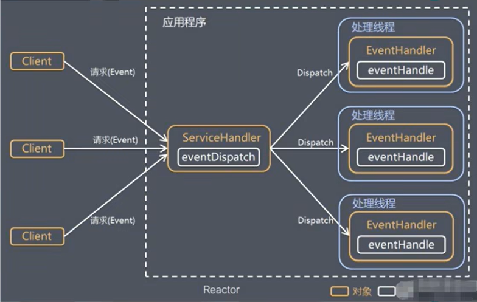
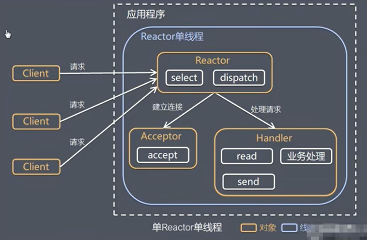
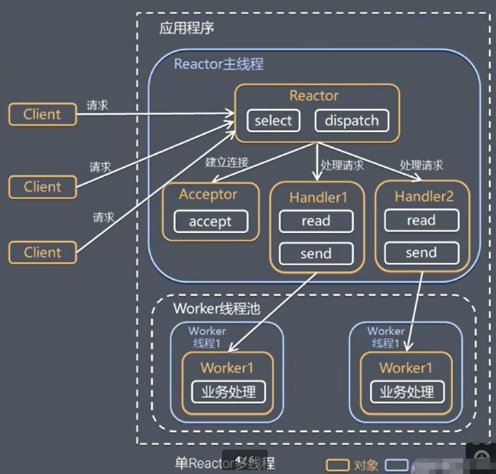
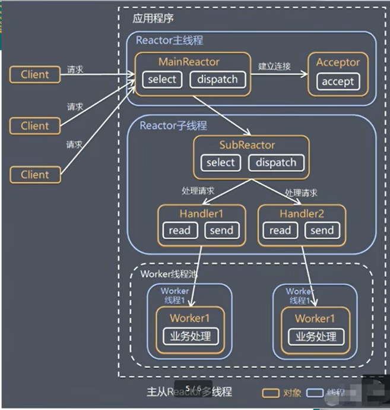
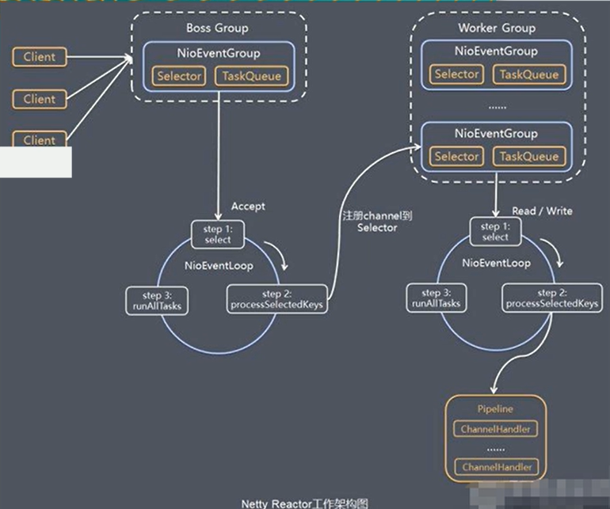

# backend-netty-learning

[TOC]

Netty学习：

Netty：

https://www.bilibili.com/video/BV1DJ411m7NR/?p=36&spm_id_from=pageDriver&vd_source=b850b3a29a70c8eb888ce7dff776a5d1

数据结构与算法：

https://www.bilibili.com/video/BV1E4411H73v/?spm_id_from=333.337.search-card.all.click&vd_source=b850b3a29a70c8eb888ce7dff776a5d1

JVM：

https://www.bilibili.com/video/BV1PJ411n7xZ/?spm_id_from=333.788.recommend_more_video.2&vd_source=b850b3a29a70c8eb888ce7dff776a5d1

Nginx：

https://www.bilibili.com/video/BV1yS4y1N76R/?spm_id_from=333.788.recommend_more_video.2

MySQL：https://www.bilibili.com/video/BV1iq4y1u7vj/?vd_source=b850b3a29a70c8eb888ce7dff776a5d1

Spring：

https://www.bilibili.com/video/BV1kR4y1b7Qc/?vd_source=b850b3a29a70c8eb888ce7dff776a5d1

SpringBoot2：

https://www.bilibili.com/video/BV19K4y1L7MT/

SpringCloud:

https://www.bilibili.com/video/BV18E411x7eT/?vd_source=b850b3a29a70c8eb888ce7dff776a5d1

前端三件套：

https://www.bilibili.com/read/cv5650633

https://www.bilibili.com/video/BV1p84y1P7Z5/?p=4&spm_id_from=pageDriver&vd_source=b850b3a29a70c8eb888ce7dff776a5d1

在线支付：

https://www.bilibili.com/video/BV1US4y1D77m/?spm_id_from=333.788.recommend_more_video.2&vd_source=b850b3a29a70c8eb888ce7dff776a5d1

# 一、开始

## Netty的介绍

1）Netty是由JBOSS提供的一个Java开源框架，现为Github上的独立项目。

2）Netty是一个异步的、基于事件驱动的网络应用框架，用以快速开发高性能、高可用性的网络IO程序。

3）Netty主要针对在TCP协议下，面向Clients端的高并发应用，或者Peer-to-Peer场景下的大量数据持续传输的应用。

4）Netty本质上是一个NIO框架，适用于服务器通讯相关的多种应用场景。

## I/O模型及适用场景

1）BIO（`同步阻塞`）方式适用于**连接数目比较小且固定**的架构，这种方式对服务器资源要求比较高，并发局限于应用中，JDK1.4以前的唯一选择，但程序简单易于理解。

2）NIO（`同步非阻塞`）方式适用于**连接数目多且连接比较短（轻操作）**的架构，比如聊天服务器，弹幕系统，服务器间通讯等。编程比较复杂，JDK1.4开始支持。【Netty】

3）AIO（`异步非阻塞`）方式适用于**连接数目多且连接比较长（重操作）**的架构，比如相册服务器，充分调用OS参与并发操作，编程比较复杂，JDK7开始支持。

## Java NIO基本介绍

1）Java NIO全称java non-blocking IO，是指JDK提供的新特性。从JDK1.4开始，Java提供了一系列的输入/输出的新特性，被称为NIO（即New IO），是**同步非阻塞**的。

2）NIO相关的类都被放在`java.nio`包及其子包下，并且对原`java.io`包中的很多类进行改写。

3）NIO有三大核心部分：

- Channel（通道）
- Buffer（缓冲区）
- Selector（选择器）

4）NIO是**面向缓冲区，或者面向块**编程的。数据读取到一个它稍后处理的缓冲区，需要时可以在缓冲区中前后移动，这就增加了处理过程中的灵活性，使用它可以提供非阻塞式的高伸缩性网络。

5）Java NIO的非阻塞模式，使一个线程从某通道发出请求或者读取数据，但是它仅能得到目前可用的数据，如果目前没有数据可用时，就什么都不会获取，而**不是保持线程阻塞**，所以直至数据变得可以读取之前，该线程可以继续做其他的事情。非阻塞写也是如此，一个线程请求写入一些数据到某通道，但不需要等待它完全写入，这个线程同时可以去做别的事情。

6）通俗理解：NIO是可以做到用一个线程来处理多个操作的。假设有10000个请求过来，根据实际情况，可以分配50或者100个线程来处理。不像之前的阻塞IO那样，非得分配10000个线程。

7）HTTP2.0使用了多路复用的技术，做到同一个连接并发处理多个请求，而且并发请求的数量比HTTP1.1大了好几个数量级。

## NIO和BIO的比较

1）BIO以流的方式处理数据，而NIO以快的方式处理数据，块I/O的效率比流I/O高很多。

2）BIO是阻塞的，NIO则是非阻塞的。

3）BIO基于字节流和字符流进行操作，而NIO基于Channel（通道）和Buffer（缓冲区）进行操作，数据总是从通道读取到缓冲区中，或者从缓冲区写入到通道中。Select（选择器）用于监听多个通道的事件（比如：连接请求，数据到达等等），因此使用单个线程就可以监听多个客户端通道。

## NIO三大核心原理示意图


1）每一个Channel都会对应一个Buffer；

2）每一个Selector对应一个线程；一个线程对应多个Channel；

3）该图反应了有三个Channel注册到该Selector

4）程序切换到哪一个Channel是由事件决定的，Event就是一个重要的概念

5）Select会根据不同的事件，在各个通道上切换

6）Buffer就是一个内存块，底层是有一个数组

7）数据的读取和写入是通过Buffer，这个和BIO不同，BIO中要么是输入流，或者是输出流，不能双向，但是NIO的Buffer是可以读取和写入的，需要flip操作切换模式

8）Channel是双向的，可以返回底层操作系统的情况，比如Linux，底层的操作系统通道就是双向的。

## 缓冲区

Buffer类定义了所有的缓冲区都具有的四个属性来提供关于其所包含的数据元素的信息：

不变性：mark<=position<=limit<=capacity

| 属性     | 描述                                                         |
| -------- | ------------------------------------------------------------ |
| mark     | 标记                                                         |
| position | 位置，下一个要被读或写的元素的索引，每次读写缓冲区数据时都会改变其值，为下次读写作准备。 |
| limit    | 表示缓冲区的当前终点，不能对缓冲区超过极限的位置进行读写操作。且极限是可以修改的。 |
| capacity | 容量，即可以容纳的最大数据量；在缓冲区创建时被设定并且不能改变。 |

### ByteBuffer API

- 缓冲区创建相关API

  - 创建直接缓冲区

  ```java
  public static ByteBuffer allocateDirect(int capacity)
  ```

  - 设置缓冲区的初始容量

  ```java
  public static ByteBuffer allocate(int capacity)
  ```

  - 把一个数组放到缓冲区中使用

  ```java
  public static ByteBuffer wrap(byte[] array)
  ```

  - 构造初始化位置offset和上界length的缓冲区

  ```java
  public static ByteBuffer wrap(byte[] array, int offset, int length)
  ```

- 缓冲区存取相关API

  - 从当前位置position上get，get之后，position会自动+1

  ```java
  public abstract byte get();
  ```

  - 从绝对位置get

  ```java
  // 索引从0开始
  public abstract byte get(int index);
  ```

  - 从当前位置上面put，put之后，potition会自动+1

  ```java
  public abstract ByteBuffer put(byte b);
  ```

  - 从绝对位置上put

  ```java
  public abstract ByteBuffer put(int index, byte b);
  ```


### Buffer API

```java
// JDK1.4引入的API
// 返回此缓冲区的容量
public final int capacity();
// 返回此缓冲区的位置
public final int position();
// 设置此缓冲区的位置
public final Buffer position(int newPosition);
// 返回此缓冲区的限制
public final int limit()
// 设置此缓冲区的限制
public final Buffer limit(int newLimit)
// 在此缓冲区的位置设置标记
public final Buffer mark()
// 将此缓冲区的位置重置为以前标记的位置
public final Buffer reset()
// 清除此缓冲区，即将各个标记恢复到初始状态，但是数据并没有真正擦除
public final Buffer clear()
// 翻转此缓冲区（读写切换）
public final Buffer flip()
// 重绕此缓冲区：方法将position设置为0，但是不会动buffer里的数据，这样可以从头开始重新读取数据，limit的值不会变，这意味着limit依旧标志着能读多少数据。
public final Buffer rewind();
// 返回当前位置与限制之间的元素数
public final int remaining()
// 告知在当前位置和限制之间是否有元素
public final boolean hasRemaining()
// 告知此缓冲区是否为只读缓冲区
public abstract boolean isReadOnly();

// JDK1.6时引入的API
// 告知此缓冲区是否具有可访问的底层实现数组
public abstract boolean hasArray();
// 返回此缓冲区的底层实现数组
public abstract Object array();
// 返回此缓冲区的底层实现数组中第一个缓冲区元素的偏移量
public abstract int arrayOffset();
// 告知此缓冲区是否为直接缓冲区
public abstract boolean isDirect();
```

## 通道

1）NIO的通道类似于流，但有些区别如下：

- 通道可以同时进行读写，而流只能读或者只能写。
- 通道可以实现异步读写数据。
- 通道可以从缓冲读数据，也可以写入数据到缓存。

2）BIO中的stream是单向的，例如FileInputStream对象只能进行读取数据的操作，而NIO中的通道（Channel）是双向的，可以读操作，也可以写操作。

3）Channel在NIO中是一个接口 `public interface Channel extends Closeable`

4）常用的Channel类有：

- FileChannel：用于文件的数据读写
- DatagramChannel：用于UDP的数据读写
- ServerSocketChannel：用于TCP的数据读写
- SocketChannel：用于TCP的数据读写

### FileChannel类

主要用来对本地文件进行IO操作，常见的方法有：

```java
// 从通道读取数据并放到缓冲区中
public abstract int read(ByteBuffer dst)
// 把缓冲区中的数据写到通道中
public abstract int write(ByteBuffer src)
// 从目标通道中复制数据到当前通道
public abstract long transferFrom(ReadableByteChannel src, long position, long count)
// 把数据从当前通道复制给目标通道
public abstract long transferTo(long position, long count, WritableByteChannel target)
```

### 关于Buffer和Channel的注意事项和细节

1）ByteBuffer支持类型化的put和get，put放入的是什么数据类型，get就应该使用相应的数据类型来取出，负责可能有BufferUnderflowException异常。

2）可以将一个普通Buffer转成只读Buffer。

3）NIO还提供了MappedByteBuffer，可以让文件直接在内存（堆外内存）中进行修改，而如何同步到文件由NIO来完成。

4）NIO还支持通过多个Buffer（即Buffer数组）完成读写操作，即Scattering（[ˈskætərɪŋ]分散）和Gethering（[[ˈgetərɪŋ]]聚合）。

## 选择器

1）Java的NIO，用非阻塞的IO方式。可以用一个线程，处理多个客户端连接，就会使用到Selector（选择器）。

2）Selector能够检测多个注册的的通道上是否有事件发生（注意：多个Channel以事件的方式可以注册到同一个Selector），如果有事件发生，便获取事件然后针对每个事件进行相应的处理。这样就可以只用一个线程去管理多个通道，也就是管理多个连接和请求。

3）只有在连接真正有读写事件发生时，才会进行读写，就大大减少了系统开学，并且不必为每个连接都创建一个线程，不用去维护多个线程。

4）避免了多线程之间的上下文切换导致的开销。

### 特点再说明：

1）Netty的IO线程NioEventLoop聚合了Selector（选择器，也叫多路复用器），可以同时并发处理成百上千个客户端连接。

2）当线程从某客户端Socket通道进行读写数据时，若没有数据可用，该线程可以进行其他任务。

3）线程通常将非阻塞I/O的空闲时间用于在其他通道上执行I/O操作，所以单独的线程可以管理多个输入和输出通道。

4）由于读写操作都是非阻塞的，这就可以充分提升I/O线程的运行效率，避免由于频繁I/O阻塞导致的线程挂起。

5）一个IO线程可以并发处理N个客户端连接和读写操作，这从根本上解决了传统同步阻塞I/O一连接一线程模型，架构的性能、弹性伸缩能力和可靠性都得到了极大的提升。

### Selector API

```java
// 得到一个选择器对象
public static Selector open()
// 监控所有注册的通道，当其中有I/O操作可以进行时，将对应的SelectionKey加入到内部结合中并返回，参数用来设置超时时间
public abstract int selectNow(); // 不阻塞，立马返还
public abstract int select() // 阻塞
public abstract int select(long timeout)  // 阻塞 timeout 毫秒， 在 timeout 毫秒后返回
public abstract Selector wakeup(); // 唤醒Selector
// 从内部集合中得到所有的SelectionKey
public abstract Set<SelectionKey> selectedKeys();
```

### 注意事项

1）NIO中的ServerSocketChannel功能类似ServerSocket，SocketChannel功能类似Socket

### NIO非阻塞网络编程原理分析图

NIO非阻塞网络编程相关的（Selector、SelectionKey、ServerSocketChannel和SocketChannel）关系梳理图。


1）创建ServerSocketChannel，设置非阻塞，监听指定端口，并注册到Selector上，Selector保持监听状态。

2）当客户端连接时，会通过ServerSocketChannel得到对应的SocketChannel

3）将SocketChannel注册到Selector上，

```java
public final SelectionKey register(Selector sel, int ops)
```

一个 Selector 上可以注册多个 SocketChannel。

4）注册后返回一个 SelectionKey，会和该 Selector 关联（集合）

5）Selector 进行监听 select 方法，返回有事件发生的通道的个数。

6）进一步得到各个 SelectionKey

7）再通过 SelectionKey 反向获取 SocketChannel，方法 channel()

8）可以通过得到的 channel，完成业务处理。


## NIO与零拷贝

### 零拷贝基本介绍

1）零拷贝是网络编程的关键，很多性能优化都离不开。

2）在Java程序中，常用的零拷贝有mmap（内存映射）和sendFile。那么，他们在OS里，到底是怎么样的一个的设计？我们分析mmap和sendFile这两个零拷贝。

3）另外，我们看下NIO中如何使用零拷贝。

### 普通的IO

我们以读取一个 本地磁盘文件的内容并通过网络发送为例，我们先要说说一个普通的IO操作是怎么样的。


1）系统接收到网络用户读取文件的请求
2）应用程序发起系统调用, 从用户态切换到内核态(第一次上下文切换)
3）内核态中把数据从硬盘文件读取到内核中间缓冲区(kernel buf)
4）数据从内核中间缓冲区(kernel buf)复制到(用户态)应用程序缓冲区(app buf),从内核态切换回到用户态(第二次上下文切换)，Read操作完毕。
5）应用程序开始发送数据到网络上
6）应用程序发起系统调用,从用户态切换到内核态(第三次上下文切换)
7）内核中再把数据从socket的缓冲区(socket buf)发送到网卡的缓冲区(NIC buf)上
8）从内核态切换回到用户态(第四次上下文切换)，Write操作完毕

由上述流程得知，一次read-send涉及到四次拷贝：

1）硬盘拷贝到内核缓冲区（DMA COPY）

2）内核缓冲区拷贝到应用程序缓冲区（CPU COPY）

3）应用程序缓冲区拷贝到Socket缓冲区（CPU COPY）

4）Socket缓冲区拷贝到网卡的缓冲区（DMA COPY）

> 注：DMA（direct memory access）

#### DMA COPY和CPU COPY

简单来说，DMA COPY是由硬盘的芯片完成的，不需要CPU参与，把CPU的算力解放出来了。

其中涉及到2次CPUP中断，还有4次的上下文切换。

很明显，第二次和第三次的COPY只是把数据复制到应用程序缓冲区，然后又原封不动的复制回来，为此带来了两次的CPU COPY和两次上下文切换，是完全没有必要的，那么有么有什么办法能够解决掉这种没有意义的复制呢？

### MMap（减少1次COPY）

能否让应用程序缓冲区共享内核缓冲区呢？

这样发送的时候就不需要把数据从内核缓冲区拷贝到应用程序缓冲区了，直接可以让Socket缓冲区读取内核缓冲区的数据，减少一次COPY。

这就是MMap（内存映射文件）技术：也即是，将一个文件或者其它对象映射到进程的地址空间，实现文件磁盘地址和进程虚拟地址空间中一段虚拟地址的一一对应关系。


应用程序调用MMap，磁盘文件中的数据通过DMA拷贝到内核缓冲区，接着操作系统会将这个缓冲区与应用程序共享，这样就不用往用户空间拷贝。应用程序调用write，操作系统直接将数据从内核缓冲区拷贝到Socket缓冲区，最好再通过DMA拷贝到网卡发出去。

MMap除了在发送的时候有应用，在写入的时候也是有应用的，比如Kafka的落盘技术就用到了MMap。Kafka数据写入、是写入这块内存空间，但实际这块内存和OS内核内存有映射，也就是相当于写在内核内存空间了。且这块内存空间、内核直接能够访问到，直接落入磁盘。也就是说Kafka写入数据的时候并不是直接落盘的。

### 零拷贝（sendFile，减少2次COPY）

虽然有MMap技术，但是还是会有好几次COPY。

1）硬盘拷贝到内核缓冲区（DMA COPY）

2）内核缓冲区拷贝到Socket缓冲区（CPU COPY）

3）Socket缓冲区拷贝到网卡的缓冲区（DMA COPY）

如果能直接从内核缓冲区COPY到网卡缓冲区就好了。

Linux内核2.1开始引入一个叫sendFile系统调用，在内核2.4一会的版本中，Linux内核对Socket缓冲区描述符做了优化，通过这次优化，sendFile系统调用可以在只复制Kernel Buffer的少量元信息的基础上，把数据直接从Kernel Buffer复制到网卡的Buffer中去。从而避免了从“内核缓冲区”拷贝到“Socket缓冲区”的这一次拷贝。

这个优化后的sendFile，我们称之为支持scatter-gather特性的sendFile。

在支持scatter-gather特性的sendFile的支撑下，我们的read-send模型可以优化为：


1）应用程序开始读文件的操作
2）应用程序发起系统调用, 从用户态进入到内核态(第一次上下文切换)
3）内核态中把数据从硬盘文件读取到内核中间缓冲区
4）内核态中把数据在内核缓冲区的位置(offset)和数据大小(size)两个信息追加(append)到socket的缓冲区中去
5）网卡的buf上根据socekt缓冲区的offset和size从内核缓冲区中直接拷贝数据
6）从内核态返回到用户态(第二次上下文切换)

最后数据拷贝变成只有两次DMA COPY:

1）硬盘拷贝到内核缓冲区（DMA COPY）

2）内核缓冲区拷贝到网卡的缓冲区（DMA COPY）

**这里明明还有2次copy，为什么叫零拷贝？因为这两次COPY都是DMA copy，是不需要CPU参与的。**

### 零拷贝的再次理解

1）我们说零拷贝，是从操作系统的角度来说的。因为内核缓冲区之间，没有数据是重复的（只有Kernel Buffer有一份数据）。

2）零拷贝不仅仅带来更少的数据复制，还能带来其他的性能优势，例如更少的上下文切换，更少的CPU缓存伪共享以及无CPU校验和计算。

### MMap和sendFile的区别

1）mmap适合小数据流量读写，sendFile适合大文件传输。

2）mmap需要4次上下文切换，3次数据拷贝；sendFile需要3次上下文切换，最少2次数据拷贝。

3）sendFile可以利用DMA方式，不再使用CPU拷贝；mmap则只能减少1次CPU拷贝（必须从内核缓冲区利用CPU拷贝到Socket缓冲区）。


## Java AIO基本介绍

1）JDK7引入了 Asynchronous I/O，即AIO。在进行I/O编程中，常用到两种模式：Reactor[/riˈæktə(r)/]和Proactor。Java的NIO就是Reactor，当有事件触发时，服务器端得到通知，进行相应的处理。

2）AIO即NIO2.0，叫做异步不阻塞的IO。AIO引入异步通道的概念，采用了Proactor模式，简化了程序编写，**有效的请求才启动线程，它的特点是先由操作系统完成后才通知服务端程序启动线程去处理**，一般适用于连接数较多且连接时间较长的应用。

3）目前AIIO还没有广泛应用，Netty也是基于NIO，而不是AIO。

## BIO、NIO、AIO对比表

|          | BIO      | NIO                    | AIO        |
| -------- | -------- | ---------------------- | ---------- |
| IO模型   | 同步阻塞 | 同步非阻塞（多路复用） | 异步非阻塞 |
| 编程难度 | 简单     | 复杂                   | 复杂       |
| 可靠性   | 差       | 好                     | 好         |
| 吞吐量   | 低       | 高                     | 高         |

举例说明：

1）同步阻塞：到理发店理发，就一直等待理发师，直到轮到自己理发。

2）同步非阻塞：到理发店理发，发现前面有其他人理发，给理发师说下，先干其他事情，一会过来看是否轮到自己。

3）异步非阻塞：给理发师打电话，让理发师上门服务，自己干其他事情，理发师来你家里给你理发。


# 二、Netty

Netty官网：https://netty.io/

Netty is *an asynchronous event-driven network application framework*
for rapid development of maintainable high performance protocol servers & clients.


## Netty官网说明

1）Netty是由JBOSS提供的一个Java开源框架。Netty提供异步的、基于事件驱动的网络应用程序框架，用以快速开发高性能、高可靠性的网络IO程序。

2）Netty开源帮助你快速、简单的开发出一个网络应用，相当于简单和流程化了NIO的开发过程。

3）Netty是目前最流行的NIO框架，Netty在互联网领域、大部分分布式计算领域、游戏行业、通信行业等获得了广泛的应用，知名的Elasticsearch、Dubbo框架内部都采用了Netty。

## 原始NIO存在的问题

1）NIO的类库和API繁杂，使用麻烦：需要数量掌握 Selector、ServerSocketChannel、SocketChannel、ByteBuffer等。

2）需要具备其他的额外技能：要熟悉Java多线程编程，因为NIO编程涉及到Reactor模式，你必须对多线程和网络编程非常熟悉，才能编写出高质量的NIO程序。

3）开发工足量和难度都非常大：例如，客户端面临断连重连、网络闪断、半包读写、失败缓存、网络拥塞和异常流的处理等等。

4）JDK NIO的Bug：例如臭名昭著的Epoll Bug，它会导致 Selecotr 空轮询，最终导致CPU 100%。直到JDK1.7版本该问题仍旧存在，没有被根本解决。

## Netty的优点

Netty对JDK自带的NIO的API进行了封装，解决了上述问题。

1）设计优雅：适用于各种传输类型的统一API阻塞和非阻塞Socket；基于灵活且可扩展的事件模型，可以清晰地分离关注点；高度可定制的线程模型 - 单线程，一个或多个线程池。

2）使用方便：详细记录的Javadoc，用户指南和示例；没有其他依赖项，JDK5（Netty 3.x）或6（Netty 4.x）就足够了。

3）高性能、吞吐量更高：延迟更低；减少资源消耗；最小化不必要的内存复制。

4）安全：完整的SSL/TLS和StartTLS支持。

5）社区活跃、不断更新：社区活跃，版本迭代周期短，发现的Bug可以被及时修复，同时，更多的新功能会被加入。

## Netty的版本

1）Netty版本分为Netty3.x和Netty4.x、Netty5.x

2）因为Netty5出现重大bug，已经被官网废弃了，目前推荐使用的是Netty4.x的稳定版本。

3）目前在官网可下载的版本Netty3.x、Netty4.0.x和Netty4.1.x。

## 线程模型基本介绍

[Scalable IO in Java](https://gee.cs.oswego.edu/dl/cpjslides/nio.pdf)

1）不同的线程模型，对程序的性能有很大影响，为了搞清Netty线程模型，我们来系统的讲解下各个线程模型，最后看看Netty线程模型有什么优越性。

2）目前存在的线程模型有：

- 传统阻塞I/O服务模型
- React模型

3）根据Reactor的数量和处理资源池线程的数量不同，有3种典型的实现

- 单Reactor单线程；

- 单Reactor多线程；
- 主从Reactor多线程

4）Netty线程模型（Netty主要基于主从Reactor多线程模型做了一定的改进，其中主从Reactor多线程模型有多个Reactor）

### 传统阻塞I/O服务模型

**工作原理图：**



- 黄色的框表示对象
- 蓝色的框表示线程
- 白色的框表示方法（API）

**模型特点：**

1）采用阻塞I/O模式获取输入的数据；

2）每个连接都需要独立的线程完成数据输入、业务处理、数据返回

**问题分析：**

1）当并发数很大，就会创建大量的线程，占用很大的系统资源；

2）连接创建后，如果当前线程暂时没有数据可读，该线程就会阻塞在read操作，造成资源的浪费


**针对传统阻塞I/O服务模型的2个缺点，解决方案：**

1）基于I/O复用模型：多个连接公用一个阻塞对象，应用程序只需要在一个阻塞对象等待，无需阻塞等待所有连接。当某个连接有新的数据可以处理时，操作系统通知应用程序，线程从阻塞状态返回，开始进行业务处理。

2）基于线程池复用线程资源：不必再为每个连接创建线程，将连接完成后的业务处理任务分配给线程进行处理，一个线程可以处理多个连接的业务。


### Reactor模型

Reactor模型的基本设计思想：IO复用+线程池

Reactor的叫法：1-反应器模型；2-分发者模型（Dispatcher）；3-通知者模式（Notifier）



**核心组成：**

1）Reactor：在一个单独的线程中运行，负责监听和分发事件，分发给适当的程序来对IO事件作出反应。

2）Handlers：处理程序执行的IO事件要完成的实际事情。Reactor通过调度适当的处理程序来响应IO事件，处理程序执行的非阻塞操作。

**模型分类：**

#### 1）单Reactor单线程



**方案说明：**

1）Select是前面I/O复用模型介绍的标准网络编程API，可以实现应用程序通过一个阻塞对象监听多路连接请求；

2）Reactor对象通过Select监控客户端请求事件，收到事件后通过Dispatch进行分发；

3）如果是建立连接请求事件，则由Acceptor通过Accept处理连接请求，然后创建一个Handler对象处理连接完成后的后续业务处理；

4）如果不是建立连接事件，则Reactor会分发调用连接对应的Handler来相应；

5）Handler会完成Read=>业务处理=>Send的完整业务流程。


**方案优缺点分析：**

1）有点：模型简单，没有多线程、进程通信、竞争的问题，全部都在一个线程中完成；

2）缺点：性能问题，只有一个线程，无法完全发挥多核CPU的性能。Handler在处理某个连接上的业务时，整个进程都无法处理其他连接事件，很容易导致性能瓶颈；

3）缺点：可靠性问题，线程意外终止，或者进入死循环，会导致整个系统通信模块不可用，不能接收和处理外部消息，造成节点故障；

4）使用场景：客户端的数量优先，业务处理非常快速，比如Redis在业务处理的时间复杂度O(1)的情况、。


#### 2）单Reactor多线程



**方案说明：**

1）Reactor对象通过select监控客户端请求事件，收到事件后，通过 dispatch 进行分发；

2）如果建立连接请求，则由 Acceptor 通过 accept 处理连接请求，然后创建一个 handler 对象处理完成连接后的各种事件;

3）如果不是连接请求，则由 Handler 来处理；

4）Handler 只负责响应事件，不做具体的业务处理，通过 read读取数据后，分发给后面的 Worker 线程池处理业务；

5）Worker 线程池会分配独立线程去完成真正的业务，并将结果返回给 Handler；

6）Handler 收到响应后，通过 send 将结果返回给 client。

**方案优缺点分析：**

1）优点：可以充分的利用多核CPU的处理能力；

2）缺点：多线程数据共享和访问比较复杂，Reactor 处理所有事件的监听和响应，在单线程运行，在高并发场景下容易出现性能瓶颈。

#### 3）主从Reactor多线程



**方案说明：**

1）Reactor 主线程 MainReactor 对象通过 select 监听连接事件，收到事件后，通过 Acceptor 处理连接事件；

2）当 Acceptor 处理连接事件后，MainReactor 将连接分配给 SubReactor；

3）SubReactor 将连接加入到连接队列进行监听，并创建 Handler 进行各种事件处理；

4）当有新事件发生时，SubReactor 就会调用对应的 handler 处理；

5）handler 通过 read 读取数据，分发给后面的Worker线程池处理；

6）Worker 线程池会分配独立的 worker 线程进行业务处理，并返回结果；

7）handler 收到响应的结果后，再通过 send 方法将结果返回给 client。

8）Reactor 主线程可以对应多个 Reactor 子线程，即 MainReactor 可以关联多个 SubReactor。

**方案优缺点说明：**

1）优点：父线程与子线程的数据交互简单职责明确，父线程只需要接收新连接，子线程完成后续的业务处理；

2）优点：父线程与子线程的数据交互简单，Reactor 主线程只需要把新连接传给子线程，子线程无需返回数据；

3）缺点：编程复杂度较高。

这种模型在许多项目中广泛使用，包括Nginx主从Reactor多进程模型，Memcached主从多线程，Netty主从多线程模型的支持。

#### 3种模型用生活案例来理解

1）单 Reactor 单线程，前台接待员和服务员是同一个人，全程为顾客服务；

2）单 Reactor 多线程，1个前台接待员，多个服务员，接待员只负责接待；

3）主从 Reactor 多线程，多个前台接待员，多个服务生。

#### Reactor模型具有如下的优点

1）响应快，不必为单个同步事件所阻塞，虽然 Reactor 本身依然是同步的；

2）可以最大程度的避免复杂的多线程及同步问题，并且避免了多线程/进程的切换开销；

3）扩展性好，可以方便的通过增加 Reactor 实例个数来充分利用CPU资源；

4）复用性好，Reactor 模型本身与具体事件处理逻辑无关，具有很高的复用性。

### Netty模型



Netty模型纠正图：


**方案说明：**

1）Netty 抽象出两组线程池 BossGroup 专门负责接收客户端的连接，WorkerGroup 专门负责网络的读写；

2）Boss Group 和 Worker Group 类型都是 NioEventLoopGroup；

3）NioEventLoopGroup 相当于一个事件循环组，这个组中含有多个事件循环，每一个事件循环是 NioEventLoop；

4）NioEventLoop 表示一个不断循环的执行处理任务的线程，每个 NioEventLoop 都有一个 Selector，用于监听绑定在其上的 socket 的网络通讯；

5）NioEventLoopGroup 可以由多个线程，即可以含有多个 NioEventLoop

6）每个 Boss Group 下的 NioEventLoop 循环执行的步骤有3步

- 轮询 accept 事件
- 处理 accept 事件，与 client 建立连接，生成 NioSocketChannel，并将其注册到某个 worker NioEventLoop 上的 selector
- 处理任务队列的任务，即 runAllTasks

7） 每个 Worker Group 下的NioEventLoop 循环执行的步骤有3不

- 轮询 read、write 事件
- 处理I/O事件，即 read、write 事件，在对应的 NioSocketChannel 处理
- 处理任务队列的任务，即 runAllTasks

8） 每一个 Worker Group 下的 NioEventLoop 处理业务时，会使用 Pipeline（管道），Pipeline 中包含了 channel，即通过 Pipeline 可以获取到对应通道，管道中维护了很多的处理器。
